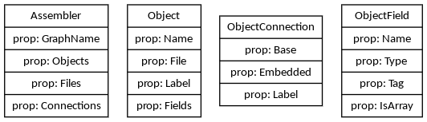

Struct Visualizer
================

I needed something that will quickly visualize all my structures so I can see if I missed something or if even if it makes sense.

This is still work in progress, so if anyone wants to use it and need different stuff inside feel free to send me a PR.

##Installation

```bash
go get github.com/ilijamt/structvizualizer/cmd/structvizualize
```

## Usage

Examples of how to use it 

```bash
structvizualizer *.go
structvizualizer model.go
structvizualizer /model.go package.go ./folder/model.go
```

Current project visualisation
-----------------------------
Here is the current visualization of this project, it's quite simple

```bash
$ structvizualizer *.go
```


Examples
---------

Check the examples folder for more details

* [Example 1](examples/example01.md)
* [Example 2](examples/example02.md)