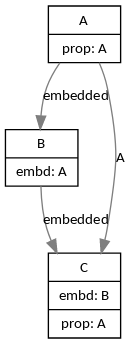

Example 1
=========

model.go
--------

```golang
type A struct {
	A string
}

type B struct {
	A
}

type C struct {
	B
	A A
}
```

Running the command
-------------------

```
$ structvizualize model.go

digraph G {

edge [color=gray50, fontname=Calibri, fontsize=11]
node [shape=record, fontname=Calibri, fontsize=11]

# Define all the models first
A [ label="{ { A }|{prop: A} }" ]
B [ label="{ { B }|{embd: A} }" ]
C [ label="{ { C }|{embd: B}|{prop: A} }" ]

# Connect all the models to where they are tied to
A -> C [ label="A" ]
A -> B [ label="embedded" ]
B -> C [ label="embedded" ]
}
```

Render
-----

