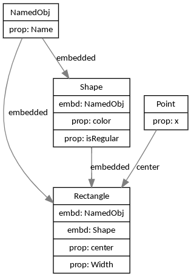

Example 1
=========

model.go
--------

```golang
type NamedObj struct {
	Name string
}

type Shape struct {
	NamedObj  //inheritance
	color     int32
	isRegular bool
}

type Point struct {
	x, y float64
}

type Rectangle struct {
	NamedObj            //multiple inheritance
	Shape               //^^
	center        Point //standard composition
	Width, Height float64
}
```

Running the command
-------------------

```
$ structvizualize model.go
digraph G {

edge [color=gray50, fontname=Calibri, fontsize=11]
node [shape=record, fontname=Calibri, fontsize=11]

# Define all the models first
NamedObj [ label="{ { NamedObj }|{prop: Name} }" ]
Point [ label="{ { Point }|{prop: x} }" ]
Rectangle [ label="{ { Rectangle }|{embd: NamedObj}|{embd: Shape}|{prop: center}|{prop: Width} }" ]
Shape [ label="{ { Shape }|{embd: NamedObj}|{prop: color}|{prop: isRegular} }" ]

# Connect all the models to where they are tied to
NamedObj -> Shape [ label="embedded" ]
Point -> Rectangle [ label="center" ]
Shape -> Rectangle [ label="embedded" ]
NamedObj -> Rectangle [ label="embedded" ]

}
```

Render
-----

